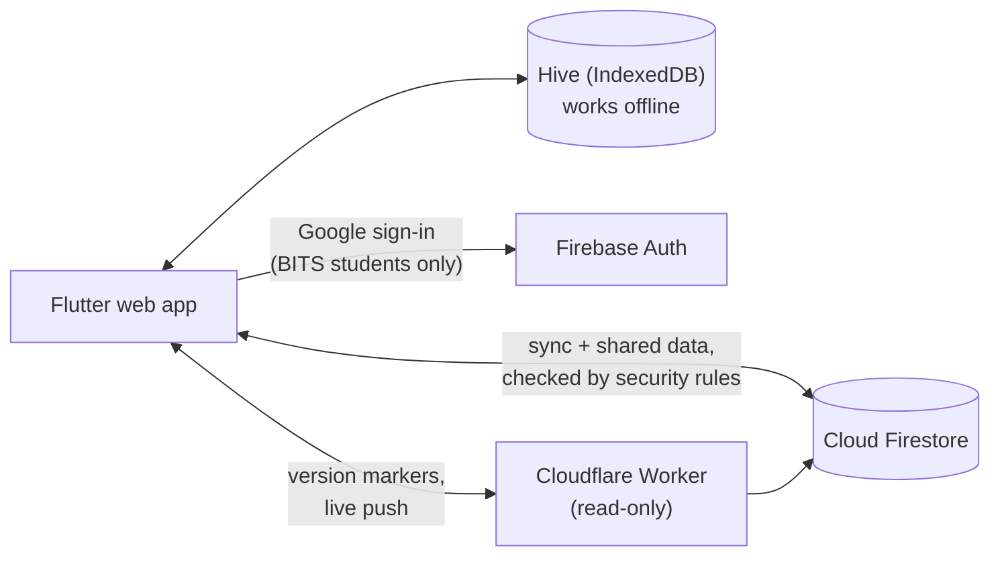

# Pointer

**The CGPA calculator for BITS Pilani students.**
Track every grade, see your SGPA and CGPA as you go, plan the semesters ahead,
and share course reviews, class averages and resources with your campus.

**Use it:** [pointer-bits-pilani.pages.dev](https://pointer-bits-pilani.pages.dev/)

Built with Flutter (web) and Firebase. The code is public, free for
non-commercial use under the [PolyForm Noncommercial License 1.0.0](LICENSE).
Maintained by
**Siddharth Mishra** ([@e-iotapi](https://github.com/e-iotapi)).

---

## Contents

- [Features](#features)
- [Release channels and branches](#release-channels-and-branches)
- [How it works](#how-it-works)
- [Performance](#performance)
- [Repository layout](#repository-layout)
- [Contributing](#contributing)
- [Privacy and security](#privacy-and-security)
- [Moving grades from the old site](#moving-grades-from-the-old-site)
- [Licence and credits](#licence-and-credits)

## Features

**For every student**

- **Your course list, filled in.** Pick your discipline and batch (single or
  dual degree) and every core course is laid out semester by semester from the
  official charts.
- **SGPA and CGPA as you go**, using the BITS rules for NC, RC, W and GD.
- **Actual, Expected and Compare**: plan what a semester needs, or compare two
  what-ifs side by side.
- **Import from ERP**: read your grades from the ERP performance sheet PDF. The
  PDF is read on your device and never uploaded.
- **Evaluative marks** per course, with best-of rules and class averages.
- **Calendar**: your timetable, filled in from the published campus timetable,
  with your midsems, compres and every dated evaluative. Month, Week and Day
  views; classes stop for exam weeks on their own.
- **Stats**: a CGPA forecast, a target planner and degree progress by CDCs,
  electives and credits.
- **The finance offshoot score.**
- **Course reviews**, anonymous, searchable and filterable by year, semester
  and professor, with class averages on every course.
- **Resources and representatives**: course handouts, your department's links,
  presidents and course representatives.
- **Works offline and syncs.** Sign in with your BITS Google account and your
  grades follow you to any browser. Install it to your home screen from
  Settings.

**For maintainers** (owners, campus admins, department presidents and
secretaries, course representatives)

- Publish the course catalogue, the timetable, class averages and evaluation
  schemes.
- Manage professors, resource links and review moderation for a department.
- Appoint and hand over roles, with every change recorded in an audit log.
- Site analytics for owners, within the free Firebase plan.

## Release channels and branches

| Branch | Who gets it | Where | What it holds |
|---|---|---|---|
| `master` | Everyone | [`/calculator/`](https://pointer-bits-pilani.pages.dev/calculator/) | The app and its deploy configuration only |
| `pointer-beta` | Beta Program members | `/beta/` on the same site | The next release; same contents as `master` |
| `pointer-dev` | Developers | [pointer-staging.web.app](https://pointer-staging.web.app) (test data) | Everything: tests, tools, design records, the demo |

Work happens on `pointer-dev`. The **release** workflow moves it forward:
`pointer-dev` → `pointer-beta` after the full test suite passes, then
`pointer-beta` → `master`. Each release is a single commit on the target
branch with the dev-only files left out, opened as a pull request. `master`
and `pointer-beta` therefore never carry tests or tooling, and their history
is one commit per release.

The beta is served from the same address as the stable app, so it shares the
student's sign-in and the same production data. Enrolling in the Beta Program
from inside the app is planned.

## How it works



- **Local first.** Every grade is saved on the device before anything else, so
  the app works without a network.
- **One document per student.** Your grades sync to `users/{uid}` with a
  revision counter; a push costs one write, and a conflict is resolved in the
  server's favour, keeping your local copy as a backup.
- **Built for the free plan.** Pointer runs on Firebase's Spark plan (50k reads
  and 20k writes a day). Shared data is kept on the phone and fetched again
  only when its version marker moves. All the timings are in
  [`lib/core/timings.dart`](lib/core/timings.dart).
- **Security rules are the backend.** Roles are Firestore documents, and
  [`firestore.rules`](firestore.rules) decides every read and write. The
  Cloudflare Worker in [`server/`](server/) only reads: it serves each
  campus's version markers and pushes changes over one WebSocket.

The full picture, with diagrams of startup, sync, the data model, roles and
releases, is in **[docs/ARCHITECTURE.md](docs/ARCHITECTURE.md)**.

## Performance

Measured on staging (Chrome throttled to 4× CPU unless noted). Method and
every number:
[docs/ARCHITECTURE.md §13](docs/ARCHITECTURE.md#13-performance-and-loading).

| What | Before | After | How |
|---|---|---|---|
| Repeat visit, first frame (iPhone user agent) | 2.05 s | 1.68 s | the page starts the Firebase sign-in check while the app loads |
| Repeat visit, bytes downloaded | 858 KB | 176 KB | app files are revalidated (304) instead of downloaded again |
| Opening any screen after a relaunch | spinner, then a network read | saved data in the first frame | data kept on the phone, refreshed only when its version moves |
| iPhone loads stalling ~30 s on the first sync | 3 in 10 | 0 in 10 | Firestore uses long polling on iOS |

## Repository layout

What `master` and `pointer-beta` hold:

```text
lib/
  main.dart            startup and sign-in
  app/                 router, routes and theme
  features/            student screens: semester, marks, calendar, stats, reviews…
  admin/               maintainer screens (loaded only when opened)
  core/                stores, models and grading rules
    timings.dart       every sync and cache timing, with its cost
  shared/              the widget kit every screen is built from
web/                   index.html, manifest and app icons
assets/                the course catalogue and the brand (assets/brand)
fonts/                 bundled fonts
landing/               the static landing page served at /
server/                the Cloudflare Worker: version markers and live push
redirect/              the old Netlify address, forwarding to the new one
firestore.rules        the access rules: the real backend
firestore.indexes.json the Firestore composite indexes
docs/                  architecture, and the old-site export script
.github/workflows/     deploy, release and staging pipelines
```

`pointer-dev` adds `test/`, `test_env/`, `tools/`, `demo/`,
`agent_instructions/` (the design records), `agent_toolchains/` (verification
scripts) and [`docs/DEVELOPMENT.md`](https://github.com/e-iotapi/Pointer/blob/pointer-dev/docs/DEVELOPMENT.md).

## Contributing

Issues and pull requests are welcome. **Branch from `pointer-dev` and open
your pull request against it**, never against `master` or `pointer-beta`:
those two only take releases.

1. **Open an issue first** for anything bigger than a small fix, so we can
   agree on the approach.
2. **Read [`docs/DEVELOPMENT.md`](https://github.com/e-iotapi/Pointer/blob/pointer-dev/docs/DEVELOPMENT.md)**
   on `pointer-dev`: setting up, the local emulators, tests and checks.
3. **Build UI from the existing kit.** New screens reuse the widgets in
   `lib/shared/widgets` and `lib/admin/widgets.dart` rather than new styles.
4. **Mind the read budget.** If a change adds Firestore reads, say how many per
   user per day in the PR. See
   [docs/ARCHITECTURE.md §2](docs/ARCHITECTURE.md#2-the-budget-that-shapes-every-design-choice).
5. **Rules changes need rules tests** (`test/rules` on `pointer-dev`).

### Contribution terms

Pointer's code is free for non-commercial use only, and the Pointer name and
logo are not licensed at all (see [Licence and credits](#licence-and-credits)).
By opening a pull request, you agree that:

- the contribution is your own work, or you have the right to submit it;
- you give Siddharth Mishra a perpetual, worldwide, royalty-free, irrevocable
  licence to use, change, relicense and distribute it as part of Pointer,
  commercially or not;
- it is otherwise under the same licence as the rest of Pointer.

## Privacy and security

- Only verified BITS student accounts can use Pointer; faculty, staff and other
  Google accounts are refused, both in the app and by the security rules.
- Your grades are readable and writable only by you. Signing out clears them
  from the device.
- Reviews are anonymous: a review stores no name or email, only a one-way hash
  that lets you edit your own.
- The in-app site analytics count a random 1 in 20 users per day, as totals
  only. The web page also loads Google Analytics for page views.
- The Cloudflare Worker never sees grades: it reads only the per-campus
  version markers.

Found a security problem? Please report it privately to the maintainer rather
than in a public issue.

## Moving grades from the old site

Grades saved in the old site's browser storage aren't transferred
automatically:

1. Open the old site and press <kbd>F12</kbd> → **Console**.
2. Paste [`docs/export_from_old_site.js`](docs/export_from_old_site.js) and
   press Enter. The JSON is copied to your clipboard.
3. Here, sign in, then **Settings → Import from old site**, paste it, and
   confirm.

## Licence and credits

© 2026 Siddharth Mishra. Pointer's code is under the
[PolyForm Noncommercial License 1.0.0](LICENSE): you may use, copy, change and
share it for non-commercial purposes. Any commercial use, including running
it with advertising, selling it or offering it as a paid service, needs
written permission.

**The Pointer brand is reserved.** The name "Pointer", the Tassel mark, the
logos and icons belong to Siddharth Mishra and are not licensed: a copy or
fork must use its own name and look, and must not present itself as Pointer.

Pointer started as a fork of
[CGPA_Calculator](https://github.com/Srijen-Raja/CGPA_Calculator) by
**Srijen Raja**; the little of his code still here stays under the
[Apache License 2.0](LICENSE-APACHE) (see [NOTICE](NOTICE)).

Thank you, Srijen, for building the calculator this all grew out of.
