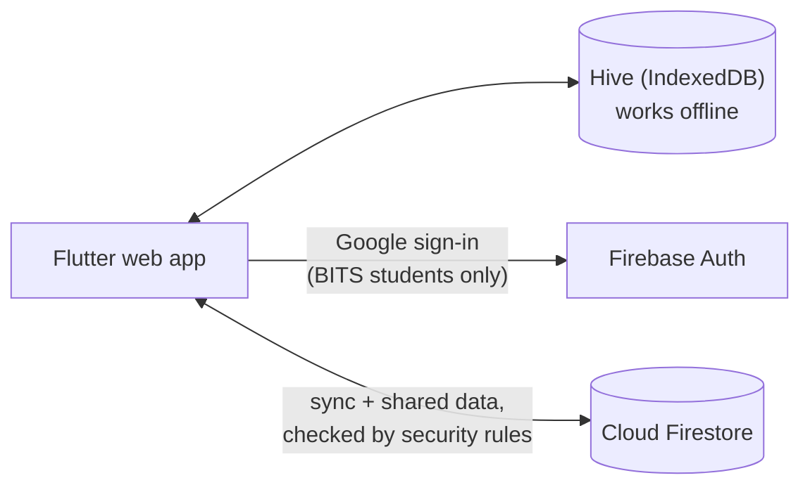

# Pointer

**The CGPA calculator for BITS Pilani, Goa and Hyderabad students.**
Track every grade, see your SGPA and CGPA as you go, plan the semesters ahead,
and share course reviews, class averages and resources with your campus.

**Use it:** [pointer-bits-pilani.pages.dev](https://pointer-bits-pilani.pages.dev/)

Built with Flutter (web) and Firebase. Open source under the
[Apache 2.0 licence](LICENSE). Maintained by
**Siddharth Mishra** ([@e-iotapi](https://github.com/e-iotapi)).

---

## Contents

- [Features](#features)
- [How it works](#how-it-works)
- [Performance](#performance)
- [Getting started](#getting-started)
- [Testing](#testing)
- [Deployment](#deployment)
- [Project structure](#project-structure)
- [Contributing](#contributing)
- [Privacy and security](#privacy-and-security)
- [Moving grades from the old site](#moving-grades-from-the-old-site)
- [Licence](#licence)

## Features

**For every student**

- **Your course list, filled in.** Pick your discipline and batch (single or
  dual degree) and every core course is laid out semester by semester from the
  official charts.
- **SGPA and CGPA as you go**, using the BITS rules for NC, RC, W and GD.
- **Actual, Expected and Compare**: plan what a semester needs, or compare two
  what-ifs side by side.
- **Import from ERP**: read your grades from the ERP performance sheet PDF. The
  PDF is read on your device and never uploaded.
- **Evaluative marks** per course, with best-of rules, class averages and a
  calendar of what's due.
- **Stats**: a CGPA forecast, a target planner and degree progress by CDCs,
  electives and credits.
- **The finance offshoot score.**
- **Course reviews**, anonymous, searchable and filterable by year and semester.
- **Resources and representatives**: your department's links, presidents and
  course representatives.
- **Works offline and syncs.** Sign in with your BITS Google account and your
  grades follow you to any browser. Install it to your home screen from
  Settings.

**For maintainers** (owners, campus admins, department presidents and
secretaries, course representatives)

- Publish the course catalogue, class averages and evaluation schemes.
- Manage professors, resource links and review moderation for a department.
- Appoint and hand over roles, with every change recorded in an audit log.
- Site analytics for owners, within the free Firebase plan.

## How it works



- **Local first.** Every grade is saved on the device before anything else, so
  the app works without a network.
- **One document per student.** Your grades sync to `users/{uid}` with a
  revision counter; a push costs one write, and a conflict is resolved in the
  server's favour, keeping your local copy as a backup.
- **Built for the free plan.** Pointer runs on Firebase's Spark plan (50k reads
  and 20k writes a day), so shared data is cached and fetched only when it
  changed. All the timings are in [`lib/core/timings.dart`](lib/core/timings.dart).
- **Security rules are the backend.** There is no server of its own: roles are
  Firestore documents, and [`firestore.rules`](firestore.rules) decides every
  read and write.

The full picture, with diagrams of startup, sync, the data model and roles, is
in **[docs/ARCHITECTURE.md](docs/ARCHITECTURE.md)**.

## Performance

Measured on staging (Chrome throttled to 4× CPU unless noted; iPhone results
from a real iPhone 13). Method and every number:
[docs/ARCHITECTURE.md §13](docs/ARCHITECTURE.md#13-performance-and-loading).

| What | Before | After | How |
|---|---|---|---|
| Repeat visit, first frame (iPhone user agent) | 2.05 s | 1.68 s | the page starts the Firebase sign-in check while the app loads |
| Repeat visit, first frame (desktop) | 1.80 s | 1.50 s | same |
| Repeat visit, bytes downloaded | 858 KB | 176 KB | app files are revalidated (304) instead of downloaded again |
| iPhone scrolling | visible judder | smooth (owner, iPhone 13) | the app draws at most 2× pixel density |
| Reopening any screen, admin pages included | spinner every time | last data at once, refreshed behind | per-screen cache |
| Opening any screen after a relaunch | spinner, then a network read | saved data in the first frame, no spinner (live admin queues keep their buttons off until fresh) | data kept on the phone, refreshed only when its version moves |
| iPhone loads stalling ~30 s on the first sync | 3 in 10 | 0 in 10 | Firestore uses long polling on iOS |

**Next:** every data store keeps its data on the phone and is refreshed from
the campus version markers, and screens are loaded ahead in levels (Home →
More → sub-pages → Admin), so no screen waits on the network. See
§13 of the architecture document.

## Getting started

**You need:** [Flutter](https://docs.flutter.dev/get-started/install) (Dart
SDK ^3.7), [Node.js](https://nodejs.org/) (LTS), the
[Firebase CLI](https://firebase.google.com/docs/cli) and Java 21 (for the
Firestore emulator).

```sh
git clone https://github.com/e-iotapi/CGPA_Calculator.git
cd CGPA_Calculator
flutter pub get
```

### Run against local emulators (recommended)

This starts the Auth and Firestore emulators, seeds them with test accounts and
data, and serves the app against them. Nothing touches a real project.

```sh
tools/test_env/up.sh
```

Then open the app with `?as=<account>` to sign in as a seeded user, for example
`?as=student_full`, `?as=president` or `?as=owner`. The accounts are listed in
[`test_env/accounts.json`](test_env/accounts.json).

### Run against production

```sh
flutter run -d chrome --web-port 5000
```

This uses the production Firebase project and real Google sign-in, so you'll
need a BITS account.

### Build environments

The backend is picked at compile time with `--dart-define=POINTER_ENV=…`:

| `POINTER_ENV` | Backend | Test sign-in (`?as=`) |
|---|---|---|
| `prod` (default) | Production Firebase | removed from the build |
| `staging` | The `pointer-staging` Firebase project | yes |
| `emulator` | Local emulators | yes |

## Testing

```sh
flutter test                               # unit, widget and render tests
cd test/rules && npm install && npm test   # security rules, on the emulator
python3 agent_toolchains/code/verify.py    # format + analyzer + full suite
```

- **Screen checks:** `python3 agent_toolchains/ui_check/ui_check.py run`
  renders every screen in light and dark mode at phone widths and reports
  overflow, contrast and tap-size problems.
- **End to end:** [`tools/e2e`](tools/e2e) runs Playwright specs, including
  performance and Firestore-quota budgets, against the seeded emulator.

CI runs the analyzer, all tests, the rules tests and a production-build guard
on every pull request ([`.github/workflows`](.github/workflows)).

## Deployment

| Target | How |
|---|---|
| **Production** | A push to `master` runs the checks, builds with `--base-href /calculator/`, and deploys the app and the [landing page](landing/) to Cloudflare Pages. |
| **Firestore rules** | Deployed by hand when they change: `firebase deploy --only firestore:rules`. |
| **Staging** | `tools/test_env/staging.sh` deploys rules, seeds test data and publishes to Firebase Hosting (`pointer-staging.web.app`). It needs `STAGING_PASSWORD` and a service-account key for the seed, both kept outside the repo. |

`lib/firebase_options.dart` is generated by `flutterfire configure`. The
Firebase web API key in it is public by design; restrict it by HTTP referrer in
the Google Cloud console.

## Project structure

```text
lib/
  main.dart            startup and sign-in
  app/                 router, routes and theme
  features/            student screens: semester, marks, stats, reviews…
  admin/               maintainer screens (loaded only when opened)
  core/                stores, models and grading rules
    timings.dart       every sync and cache timing, with its cost
  shared/              the widget kit every screen is built from
test/                  Dart tests; test/rules has the security-rule tests
firestore.rules        the access rules: the real backend
landing/               the static landing page served at /
tools/                 emulator setup, seeding, e2e specs, build scripts
docs/                  architecture for contributors
agent_instructions/    design records and plans (detailed, historical)
agent_toolchains/      scripts used for verification and screen checks
```

## Contributing

Issues and pull requests are welcome.

1. **Open an issue first** for anything bigger than a small fix, so we can
   agree on the approach.
2. **Build UI from the existing kit.** New screens reuse the widgets in
   `lib/shared/widgets` and `lib/admin/widgets.dart` rather than new styles.
3. **Mind the read budget.** If a change adds Firestore reads, say how many per
   user per day in the PR. See
   [docs/ARCHITECTURE.md §2](docs/ARCHITECTURE.md#2-the-budget-that-shapes-every-design-choice).
4. **Rules changes need rules tests** in `test/rules`.
5. **Don't format legacy files.** `main.dart`, `home_page.dart`, `script.dart`,
   `course.dart`, `mastercourselist.dart`, `sync.dart` and `settings_page.dart`
   are edited by hand; `dart format` would rewrite them wholesale.
6. **Run `verify.py` before you push.** Public APIs get `///` doc comments
   ([Effective Dart](https://dart.dev/effective-dart/documentation)).

## Privacy and security

- Only verified BITS student accounts can use Pointer; faculty, staff and other
  Google accounts are refused, both in the app and by the security rules.
- Your grades are readable and writable only by you. Signing out clears them
  from the device.
- Reviews are anonymous: a review stores no name or email, only a one-way hash
  that lets you edit your own.
- The in-app site analytics count a random 1 in 20 users per day, as totals
  only. The web page also loads Google Analytics for page views; the `?as=`
  test parameter is stripped before anything is sent.

Found a security problem? Please report it privately to the maintainer rather
than in a public issue.

## Moving grades from the old site

Grades saved in the old site's browser storage aren't transferred
automatically:

1. Open the old site and press <kbd>F12</kbd> → **Console**.
2. Paste [`tools/export_from_old_site.js`](tools/export_from_old_site.js) and
   press Enter. The JSON is copied to your clipboard.
3. Here, sign in, then **Settings → Import from old site**, paste it, and
   confirm.

## Licence

[Apache License 2.0](LICENSE). © Siddharth Mishra.
