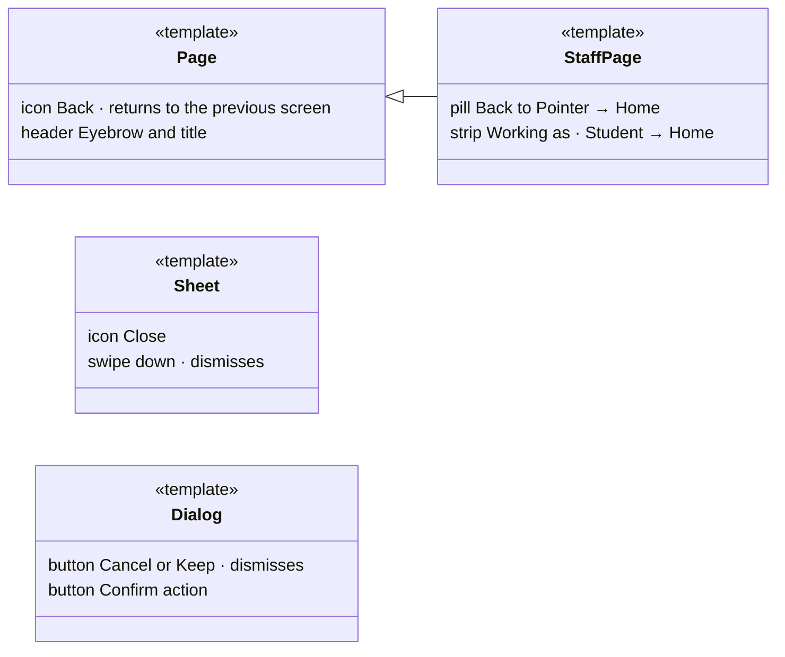
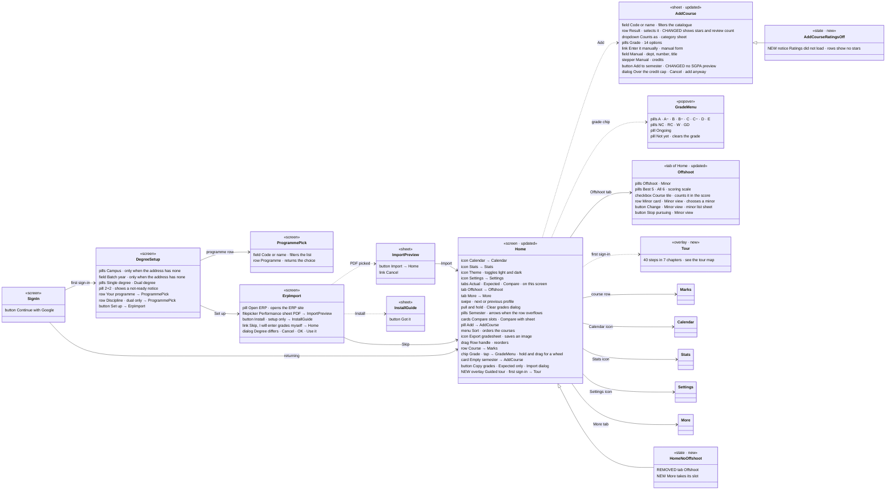
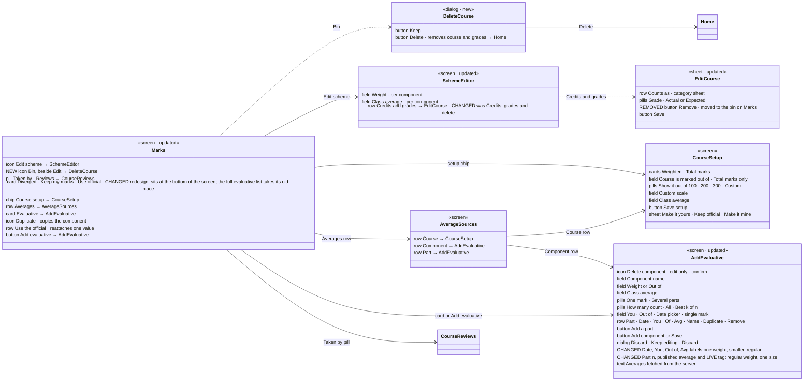
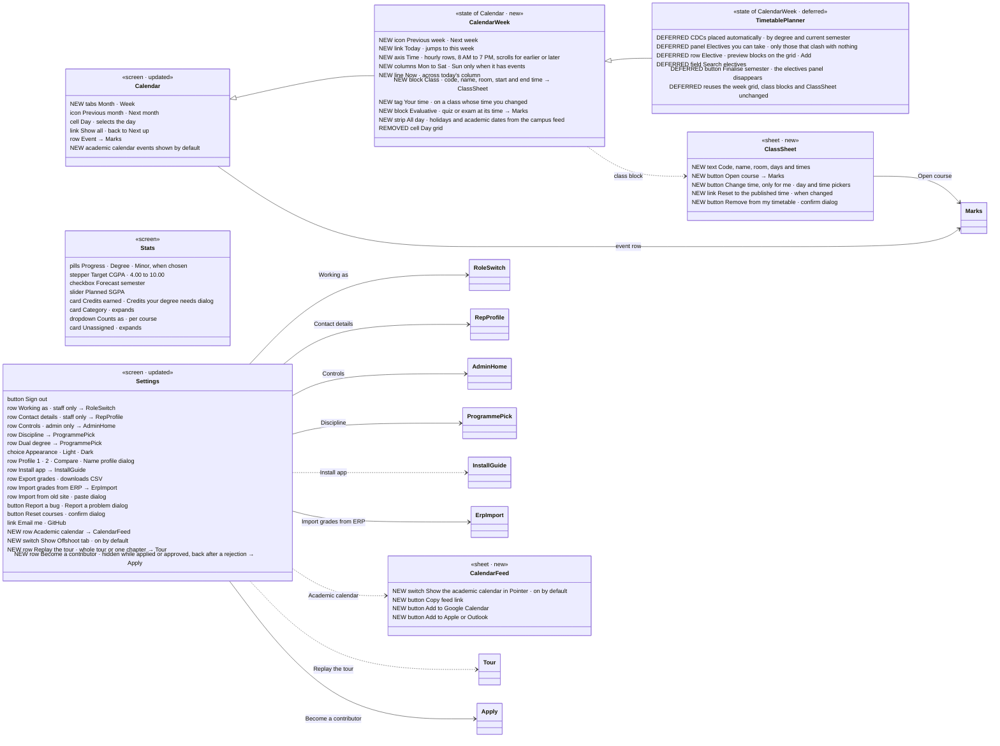
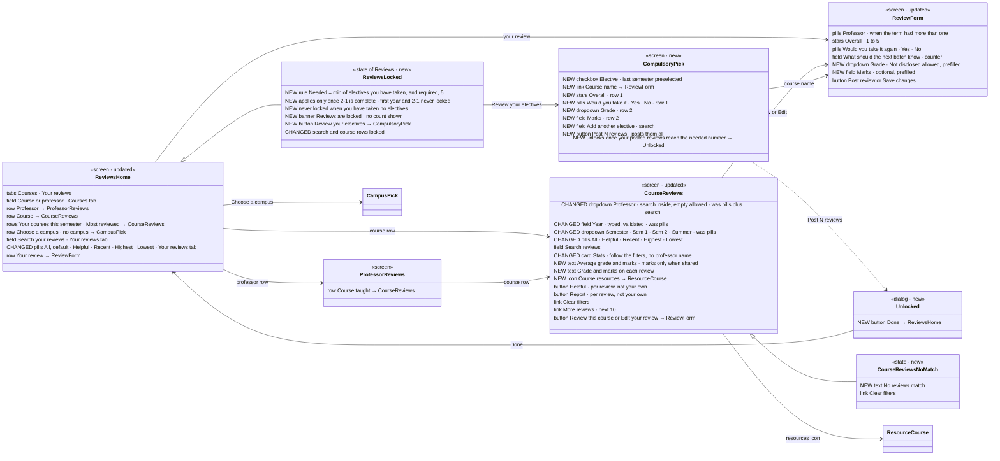
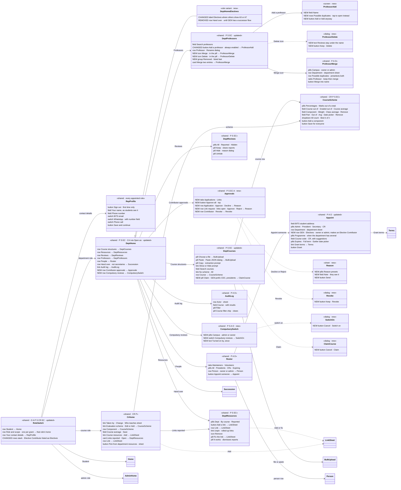
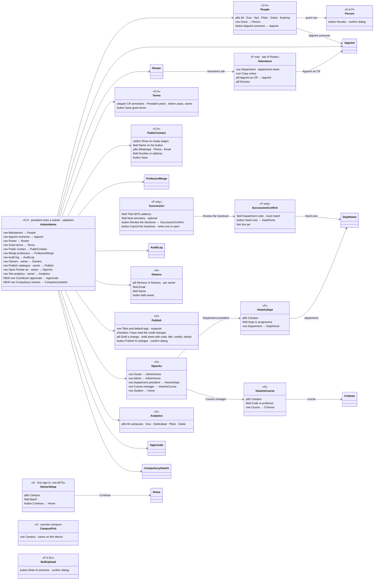

# Pointer UI map

Legend: solid arrow = navigation, dashed arrow = sheet/dialog, triangle = inheritance. Tags: NEW, CHANGED, REMOVED = build; DEFERRED = do not build; untagged = exists on staging, do not touch.

Source: the design artifact's UML map (private). Mermaid `classDiagram`/`flowchart` blocks, verbatim.

## How to read the UML

## 1 · Start and Home

## 2 · A course

## 3 · Calendar, Stats, Settings

## 4 · More, Representatives, Resources, Contributor

```mermaid
classDiagram
  direction LR
  classDef upd fill:#d9efe4,stroke:#2c7a62,stroke-width:2px
  classDef new fill:#e7defa,stroke:#6d3fd6,stroke-width:2px
  classDef stub fill:#1b1d17,stroke:#1b1d17,color:#ffffff
  class More {
    <<screen · updated>>
    card Representatives → Representatives
    card Course reviews → ReviewsHome
    card Resources → Resources
    NEW card Contributor Leaderboard · bigger, top 5 with your rank, shown to everyone → Leaderboard
  }
  class MoreContributor {
    <<state of More · new>>
    NEW card Contribute · appears when you apply → Contribute
    REMOVED card Contribute · when the application is rejected
  }
  class Representatives {
    <<screen · updated>>
    row Choose a campus · no campus → CampusPick
    pills Contact · Email · WhatsApp · Call
    icons Course contact · mail · chat · call
    pill Volunteer or Withdraw · course without a CR
    pill You are a CR · Edit → RepProfile
    row Message the public contact · owner-enabled
    CHANGED text Resources last updated Mon YYYY · per rep
  }
  class Resources {
    <<screen · rebuilt>>
    row Choose a campus · no campus → CampusPick
    NEW card Degree · one per degree → ResourceDegree
    NEW card Course resources → ResourceCourses
    pill Find your representatives · empty state → Representatives
    row Message the public contact · owner-enabled
    button Add a link · staff and contributors → LinkSheet
    REMOVED pills This semester · All · moved to Course resources
  }
  class ResourceDegree {
    <<screen · new>>
    row Link · opens the URL
    icon More options · Report sheet
    button Add a link · staff and contributors → LinkSheet
  }
  class ResourceCourses {
    <<screen · new>>
    NEW field Search a course · any degree
    NEW pills This semester · All
    NEW row Course → ResourceCourse
  }
  class ResourceCourse {
    <<screen · new>>
    NEW row Link · opens the URL
    NEW icon More options · Report sheet
    NEW pills CR contact · Email · WhatsApp · Call
    NEW text Last updated Mon YYYY · beside the CR
    NEW button Add a link · staff and contributors → LinkSheet
  }
  class ReportLink {
    <<sheet>>
    radio Reason
    field Add a note · optional
    button Send report
  }
  class LinkSheet {
    <<sheet · updated>>
    field Name
    field Link
    button Save
    CHANGED also opens from the student course page
  }
  class ContributorPrompt {
    <<sheet · new>>
    NEW button Not now
    NEW button Apply now → Apply
    NEW shown on the first Resources open each session
    NEW stops once applied · starts again after a rejection
  }
  class Apply {
    <<screen · new>>
    NEW text Rules · live now, approved within 15 days, points after approval
    NEW field Username · explained, shown on the leaderboard
    NEW error Username taken · inline under the field
    NEW button Apply → ContributePending
  }
  class ContributePending {
    <<state of Contribute · new>>
    NEW text Application sent · awaiting approval
    NEW pills President contact · Email opens mailto · WhatsApp · Call
    REMOVED button Add links · until approved
  }
  class Leaderboard {
    <<screen · new>>
    NEW rows Rank · username · branch tag · points
    NEW top 5 gold · silver · bronze · two soft purple, rank badges
    NEW row You · highlighted
  }
  class LeaderboardEmpty {
    <<state · new>>
    NEW text No contributors yet
  }
  class Contribute {
    <<screen · new>>
    NEW pills All · Awaiting · Approved · Rejected
    NEW row Link · state chip, reason when rejected → ContributeEdit
    NEW button Add links → ContributeAdd
    NEW text Points · counted after approval
  }
  class ContributeEmpty {
    <<state · new>>
    NEW text No links yet · Add links stays
  }
  class ContributeStaff {
    <<role variant · new>>
    CHANGED links publish directly, no approval states
  }
  class ContributeAdd {
    <<screen · new>>
    NEW pills Department · A course
    NEW dropdown Department · any on the campus
    NEW field Course search · any course
    NEW field Name · per link
    NEW field Link · per link
    NEW button Another link
    NEW button Publish · toast → Contribute
  }
  class ContributeEdit {
    <<screen · new>>
    NEW field Name
    NEW field Link
    NEW button Save · no delete
  }
  class ReviewsHome
  class CampusPick
  class RepProfile
  More <|-- MoreContributor
  Leaderboard <|-- LeaderboardEmpty
  Contribute <|-- ContributeEmpty
  Contribute <|-- ContributeStaff
  More --> Representatives : Representatives
  More --> ReviewsHome : Course reviews
  More --> Resources : Resources
  More --> Leaderboard : Leaderboard card
  MoreContributor --> Contribute : Contribute
  Resources --> ResourceDegree : degree card
  ResourceDegree ..> ReportLink : More options
  ResourceDegree ..> LinkSheet : Add a link
  Resources --> ResourceCourses : Course resources
  ResourceCourses --> ResourceCourse : course row
  ResourceCourse ..> ReportLink : More options
  Resources ..> LinkSheet : Add a link
  ResourceCourse ..> LinkSheet : Add a link
  Resources ..> ContributorPrompt : first open
  ContributorPrompt --> Apply : Apply now
  Apply --> ContributePending : Apply
  Contribute <|-- ContributePending
  Contribute --> ContributeAdd : Add links
  Contribute --> ContributeEdit : link row
  Representatives --> RepProfile : You are a CR
  cssClass "More,Representatives,Resources,LinkSheet" upd
  cssClass "MoreContributor,ResourceCourses,ResourceCourse,ContributorPrompt,Apply,ContributePending,Leaderboard,LeaderboardEmpty,Contribute,ContributeEmpty,ContributeStaff,ContributeAdd,ContributeEdit" new
  cssClass "ReviewsHome,CampusPick,RepProfile" stub
  
```

## 5 · Reviews and compulsory reviews

## 6 · Staff, shared screens

## 7 · Staff, role-only screens

## 8 · Guided tour

```mermaid
flowchart TB
  classDef new fill:#e7defa,stroke:#6d3fd6,stroke-width:2px,color:#25124f
  subgraph C1["Chapter 1 · Home basics · on Home"]
    direction LR
    T1["1 · Actual tab<br/><i>Your real grades. SGPA and CGPA update as you set them</i>"]:::new
    T2["2 · Swipe sideways<br/><i>Move between Actual, Expected and Compare</i>"]:::new
    T3["3 · Semester pills<br/><i>Pick a semester; the arrows scroll on a computer</i>"]:::new
    T4["4 · Grade chip, tap<br/><i>Tap a grade to change it</i>"]:::new
    T5["5 · Grade chip, hold and drag<br/><i>Hold and drag up or down to scrub through grades</i>"]:::new
    T6["6 · Add<br/><i>Add a course from the catalogue, with its star ratings, or enter one by hand</i>"]:::new
    T7["7 · Sort menu and drag handle<br/><i>Sort your courses, or drag the handle into your own order</i>"]:::new
    T8["8 · Pull down and hold<br/><i>Pull down and hold to clear this semester's grades</i>"]:::new
    T9["9 · Export gradesheet<br/><i>Save this semester's grades as an image</i>"]:::new
    T1 --> T2 --> T3 --> T4 --> T5 --> T6 --> T7 --> T8 --> T9
  end
  subgraph C2["Chapter 2 · Grade profiles"]
    direction LR
    T10["10 · Expected tab<br/><i>The grades you expect, to plan the semester</i>"]:::new
    T11["11 · Copy grades button<br/><i>Start Expected from your Actual grades in one tap</i>"]:::new
    T12["12 · Compare tab<br/><i>Two profiles side by side; tap a card to pick which</i>"]:::new
    T10 --> T11 --> T12
  end
  T9 --> T10
  subgraph C3["Chapter 3 · Marks tracker · opens your first course, skipped if you have none"]
    direction LR
    T13["13 · Course row<br/><i>Tap a course to track its marks</i>"]:::new
    T14["14 · Course setup chip<br/><i>Weighted, each part has a %, or total marks, and what it is out of</i>"]:::new
    T15["15 · Add evaluative<br/><i>Add each quiz, midsem, lab or compre: weight, your marks, out of, date</i>"]:::new
    T16["16 · Several parts, best k of n<br/><i>Split a component into parts and count only the best k</i>"]:::new
    T17["17 · Class average and Averages row<br/><i>Add the class average to see where you stand; tap to see where each average came from</i>"]:::new
    T18["18 · Official scheme<br/><i>When your CR publishes the scheme, weights and averages fill in by themselves</i>"]:::new
    T19["19 · Divergence card<br/><i>Change an official value and we keep yours, and show what changed</i>"]:::new
    T20["20 · Edit and bin icons<br/><i>Edit the scheme, credits and grade, or delete the course</i>"]:::new
    T21["21 · Taken by, Reviews<br/><i>See who teaches it this term and what past batches said</i>"]:::new
    T13 --> T14 --> T15 --> T16 --> T17 --> T18 --> T19 --> T20 --> T21
  end
  T12 --> T13
  subgraph C4["Chapter 4 · Offshoot and Minor"]
    direction LR
    T22["22 · Offshoot tab<br/><i>Your offshoot score: best 5 or all 6, tick the courses that count</i>"]:::new
    T23["23 · Minor toggle<br/><i>Choose a minor and see what it still needs</i>"]:::new
    T22 --> T23
  end
  T21 --> T22
  subgraph C5["Chapter 5 · Calendar and Stats"]
    direction LR
    T24["24 · Calendar icon<br/><i>Your evaluatives and the academic calendar, by month</i>"]:::new
    T25["25 · Week tab<br/><i>Your classes by time; tap one to change its time just for you</i>"]:::new
    T26["26 · Stats icon<br/><i>Your CGPA, semester by semester</i>"]:::new
    T27["27 · Target CGPA<br/><i>Set a target and see the SGPA you need</i>"]:::new
    T28["28 · Plan the rest<br/><i>Slide each future semester to plan your way there</i>"]:::new
    T29["29 · Degree tab<br/><i>Credits earned for each requirement; change what a course counts as</i>"]:::new
    T24 --> T25 --> T26 --> T27 --> T28 --> T29
  end
  T23 --> T24
  subgraph C6["Chapter 6 · More"]
    direction LR
    T30["30 · More tab<br/><i>Everything beyond your grades</i>"]:::new
    T31["31 · Representatives<br/><i>Your president and each course's CR, with contacts; volunteer to be a CR</i>"]:::new
    T32["32 · Course reviews<br/><i>Search a course or professor; filter by professor, year and semester</i>"]:::new
    T33["33 · Resources<br/><i>Department and course links: notes, papers, handouts</i>"]:::new
    T34["34 · Contributor Leaderboard<br/><i>The top contributors on campus; apply to join from Resources or Settings</i>"]:::new
    T30 --> T31 --> T32 --> T33 --> T34
  end
  T29 --> T30
  subgraph C7["Chapter 7 · Settings · last chapter"]
    direction LR
    T35["35 · Settings icon<br/><i>Your degree, grade profiles, data and the app</i>"]:::new
    T36["36 · Grade profiles rows<br/><i>Rename Actual, Expected and Compare</i>"]:::new
    T37["37 · Import grades from ERP<br/><i>Fill past semesters from your ERP performance sheet</i>"]:::new
    T38["38 · Appearance and Show Offshoot tab<br/><i>Light or dark, and hide the Offshoot tab if you do not need it</i>"]:::new
    T39["39 · Install app<br/><i>Add Pointer to your home screen</i>"]:::new
    T40["40 · Replay the tour<br/><i>Run this again, or one chapter, any time · Done</i>"]:::new
    T35 --> T36 --> T37 --> T38 --> T39 --> T40
  end
  T34 --> T35
  
```

## 9 · Boards that go away

## 10 · States and variants

## 11 · Before I rebuild
