# Pointer architecture

This document explains how Pointer is put together: where data lives, how it
moves, who may change what, and how a build reaches users. It is written for
contributors. The detailed design record, with every decision and its
reasoning, is [`agent_instructions/ARCHITECTURE.md`](../agent_instructions/ARCHITECTURE.md).

- [1. The shape of the system](#1-the-shape-of-the-system)
- [2. The budget that shapes every design choice](#2-the-budget-that-shapes-every-design-choice)
- [3. Code layout](#3-code-layout)
- [4. Starting the app](#4-starting-the-app)
- [5. Local data and sync](#5-local-data-and-sync)
- [6. Shared data: the catalogue, heads and index documents](#6-shared-data-the-catalogue-heads-and-index-documents)
- [7. Firestore data model](#7-firestore-data-model)
- [8. Roles and permissions](#8-roles-and-permissions)
- [9. Grades and the CGPA rule](#9-grades-and-the-cgpa-rule)
- [10. Routes and screens](#10-routes-and-screens)
- [11. Environments, testing and deployment](#11-environments-testing-and-deployment)
- [12. Things that will surprise you](#12-things-that-will-surprise-you)
- [13. Performance and loading](#13-performance-and-loading)

## 1. The shape of the system

Pointer is a Flutter web app. It has no server of its own: the browser talks
directly to Firebase, and Firestore security rules are the only thing standing
between a user and data that isn't theirs.

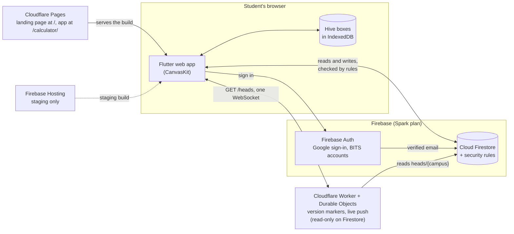

- **Offline first.** Every grade lives in Hive (IndexedDB) first. The app
  works with no network; Firestore is where a copy is kept so the grades follow
  the student to another browser.
- **Shared data is read-mostly.** The course catalogue, class averages,
  reviews, resource links and the representatives list are written by a few
  people and read by everyone, so each is cached on the device and refreshed
  only when it changed.
- **No Cloud Functions.** Anything a server would normally enforce is done by
  Firestore rules, including the consistency of summary documents (see §6).

## 2. The budget that shapes every design choice

Pointer runs on Firebase's free Spark plan: **50,000 document reads and 20,000
writes a day** for the whole project. The design target is 8,000 active
students in one day across three campuses, with surges after evaluatives. That
leaves about **6 reads and 2.5 writes per student per day**.

So every screen is designed around a question: *how many documents does this
cost?*

| Rule | Why |
|---|---|
| One document per screen where possible | Firestore bills per document returned, not per byte |
| A small "head" document says what changed | The app skips reading anything whose version didn't move |
| Local cache first, refresh in the background | A warm open costs zero reads |
| Writes are debounced | A burst of edits becomes one write |
| Summary documents are written in the same batch as the source | Screens read one summary instead of many sources |

Every freshness and throttle value (how long a cache is trusted, how often sync
pulls) lives in one file, [`lib/core/timings.dart`](../lib/core/timings.dart),
with the read and write cost of each. Change them there.

If the daily quota runs out anyway, Firestore answers `resource-exhausted`;
the app treats that as offline and keeps working from the cache.

## 3. Code layout

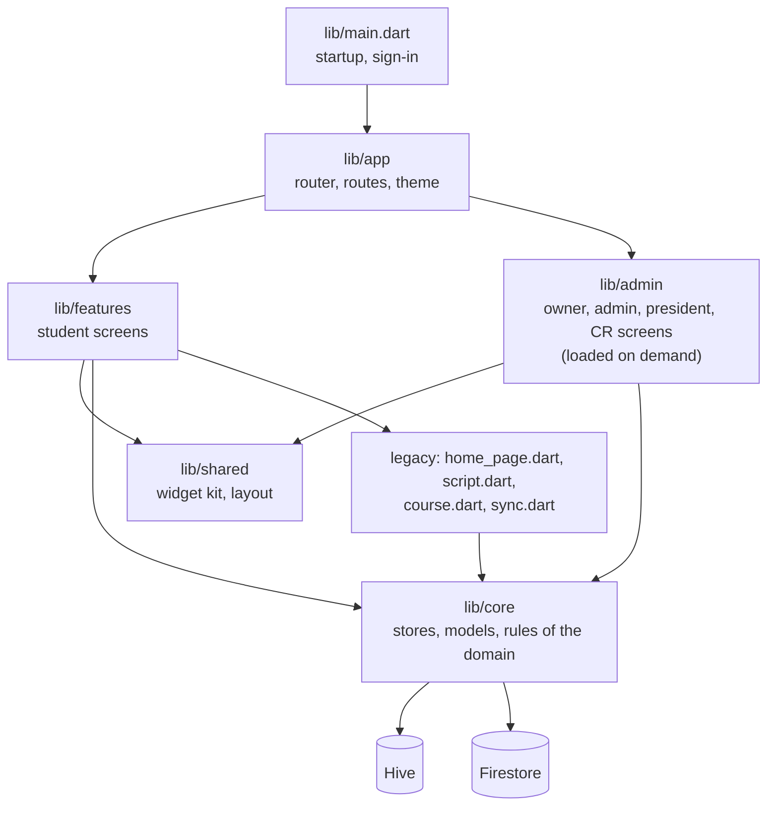

| Folder | What lives there |
|---|---|
| `lib/core/grading` | SGPA and CGPA, marks and best-of rules, degree requirements |
| `lib/core/models` | Programmes, disciplines, charts, campuses |
| `lib/core/catalog` | The course catalogue: loading, caching, publishing |
| `lib/core/heads` | The per-campus head document (§6) |
| `lib/core/roles` | Grants, the directory, contacts, sessions and capabilities |
| `lib/core/reviews`, `resources`, `professors` | The stores behind those screens |
| `lib/core/storage` | Hive helpers, overrides, seeding a new user's courses |
| `lib/core/platform` | Browser-only code behind a conditional import |
| `lib/core/env` | Which environment this build talks to (§11) |
| `lib/core/analytics`, `perf` | Sampled usage counters and dev-only timing |
| `lib/features/*` | One folder per student screen: semester, marks, stats, reviews… |
| `lib/admin` | Maintainer screens, a deferred import so students never download them |
| `lib/shared/widgets` | The shared widget kit every screen is built from |

**The UI rule.** New screens are composed from the existing widget kit
(`lib/shared/widgets` and `lib/admin/widgets.dart`), not new widgets or
styles. A new page is usually a copy of an existing screen's structure with
different data.

## 4. Starting the app

`main()` signs the user in, then `startApp()` opens local data and draws the
first frame. Nothing on the network blocks the first frame except the very
first sync on a new device. The page itself starts Firebase's app and Auth
(the saved-user check) while the engine downloads; `main()` reuses them.

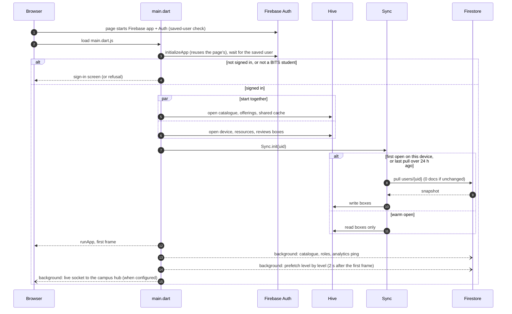

A deep link into a maintainer page (`/maintain/…`, `/admin/…`) on a first
sign-in waits for the user's roles, so the route guard doesn't bounce them
home before it knows who they are.

## 5. Local data and sync

### Hive boxes

| Box | Holds | Synced |
|---|---|---|
| `settingsBox` | Discipline, batch, campus, profile names, preferences | yes |
| `coursesBox` | Every course with its Actual, Expected and Compare grades | yes |
| `offshootBox` | Finance offshoot courses | yes |
| `marksBox` | Evaluative marks | yes |
| `syncMeta` | Local `rev`, last synced snapshot, backup, pull time | no |
| catalogue, offerings, shared cache, resources, reviews, device | Caches of shared data | no, re-fetched |

### The sync protocol

The four synced boxes are serialised into one document, `users/{uid}`, with a
revision counter `rev`.

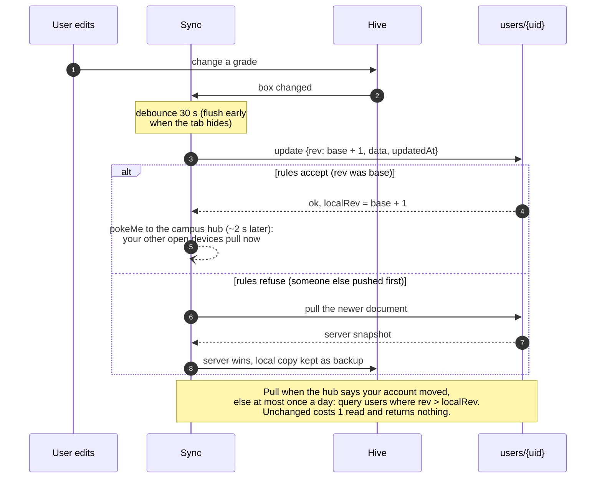

- **Push costs one write and no reads.** The rules only accept
  `rev == old rev + 1`, which is how a conflict is detected without a read.
- **The server wins a conflict**, and the local snapshot that lost is kept in
  `syncMeta['backup']`.
- **The document is capped at 500 KB** by Firestore; the snapshot stays far
  below it.
- **Sign-out wipes every local box**, so a shared computer starts clean.

## 6. Shared data: the catalogue, heads and index documents

### The catalogue

The course catalogue (every course, credit and chart) is one versioned bundle:
`catalog/marker` names the current version, and `catalog/v{n}` holds it. A
copy ships inside the app as `assets/catalog.json`, so a new device has a
catalogue before it has a network. Owners edit drafts and publish a new
version from the admin screens.

### Heads: one small document per campus

`heads/{campus}` holds version numbers: the catalogue's, the public contact,
each course's offering (`offerings`, class averages and evaluation scheme)
and a `v` map with one counter per shared path. The `v` keys are the names in
`Paths` (`lib/core/heads/paths.dart`): `resources`, `reps`, `reviews`,
`reviews/<course>`, `professors/<dept>`, `grants`, `volunteers/<dept>`,
`staff`, and on every campus `owners` and `terms`. Every write moves its
path's counter in the same batch (`bumpPath`, `bumpPathOnAllHeads`), and the
rules refuse a write that doesn't (`pathBumped`). A cached copy saved under
its path's counter stays current until the counter moves, so the app fetches
only what moved. Counters are compared for equality, never order: anyone on a
campus may move markers (the rules can't check each key's step), so a
lowered counter costs a re-read, never a freeze. The rules refuse removing a
marker, cap the map at 3000 keys, and a non-number marker (written by hand)
counts as 0, so the next real write repairs it. A reseed moves every marker
once (`tools/test_env/seed.mjs`), so phones re-read the new data.

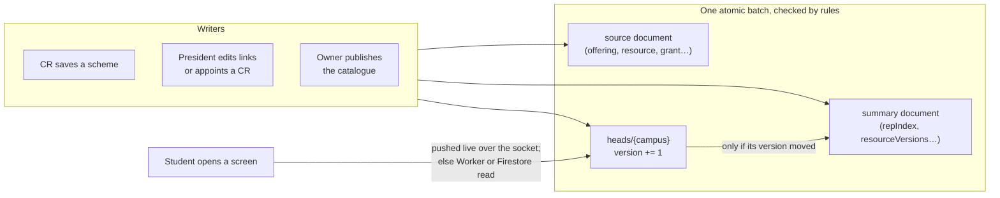

### Index documents

Screens that would otherwise read hundreds of documents read one summary
instead. Each is written in the same batch as its source, and the rules check,
with `getAfter`, that the summary matches the source after the write, so a
client can't forge it.

| Summary | Replaces | Read by |
|---|---|---|
| `reviewIndex/{campus}` | every course's review stats | Reviews home |
| `reviews/{course}/campus/{campus}` | every review of a course | Course reviews (search and filter run on the device) |
| `resourceVersions/{campus}.links` | every resource link | Resources |
| `repIndex/{campus}` | every grant and directory entry | Representatives |

## 7. Firestore data model

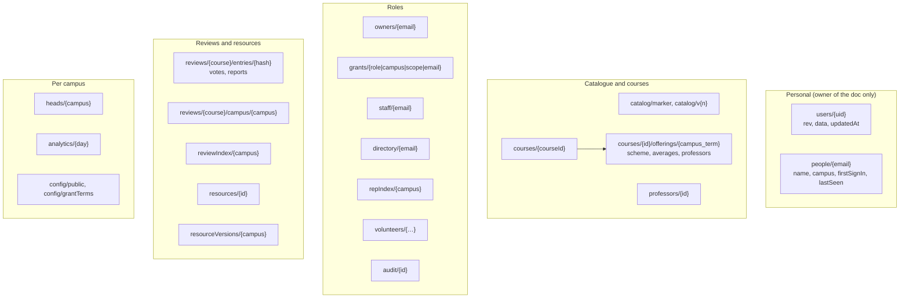

- A review is stored under `sha256(uid + courseId)`, so one person has one
  review per course and the review carries no name or email.
- `audit/` records every privileged change with the actor, before and after.
- Campus is part of almost every path or document, and the rules only let a
  student read their own campus.
- **A professor is never hard-deleted** (the rules refuse it), so every review
  keeps a professor with a name, and every filter and count keeps working:
  - *Merge:* the duplicate points at the survivor (`mergedInto`) and the
    survivor lists it (`mergedIds`). Reviews keep their original professor id
    and count as the survivor's children everywhere: its stats, its filter
    (`allIds`) and its page. Nothing is rewritten.
  - *Delete* (planned, DATA_SYNC_PLAN §5.3): a soft delete (`removed: true`,
    audited). The professor drops out of pickers and search, but its reviews
    stay, under its name, and filter and count as before.
  - A review naming an id with no document at all (only possible from a
    reseed) is skipped by every screen, live and from the saved copy alike.

## 8. Roles and permissions

Roles are data in Firestore, not Firebase custom claims (claims need Cloud
Functions). The rules look the role up on every request.

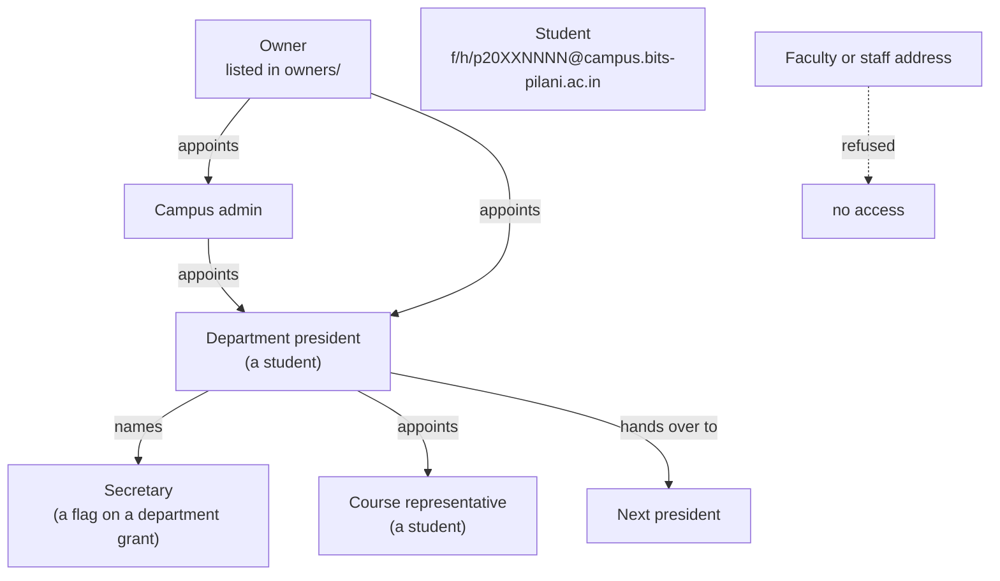

| Who | Can |
|---|---|
| Student | Own grades; read their campus's shared data; review courses they took; report links; volunteer as CR |
| CR | A course's evaluation scheme, class averages and professors, for their campus |
| President (and secretary) | Their department: courses, professors, resource links, review moderation, CRs, handover |
| Admin | Appoint presidents and CRs on their campus; grant terms |
| Owner | Everything: owners, the catalogue, the public contact, site analytics |

- **Only student addresses get in.** The rules and the app both accept
  `f`, `h` or `p` followed by digits at a BITS campus domain, plus listed
  owners. Faculty and staff addresses are refused.
- **Every grant expires.** A grant carries `expiresAt`; the rules ignore an
  expired one, so nobody keeps access after their term.
- **The rules are the enforcement.** The app hides what a user can't do, but
  the rules in [`firestore.rules`](../firestore.rules) are what actually
  refuse it, and [`test/rules`](../test/rules) tests them against the
  emulator.
- **Capabilities** in `lib/core/roles/capabilities.dart` map each role to what
  the UI offers; `test/core/capabilities_test.dart` checks them against the
  design record.

## 9. Grades and the CGPA rule

All GPA figures come from one function, `tally` in
[`lib/core/grading/cgpa.dart`](../lib/core/grading/cgpa.dart). Anything that
shows a GPA or a credit count calls it, so no two screens can disagree.

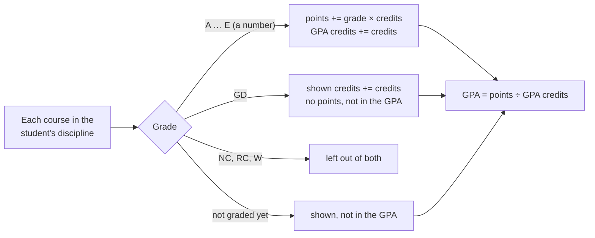

The semester list and the GPA both filter courses through the same
`inDiscipline` check, so a course is counted exactly when it's shown.

## 10. Routes and screens

Routing is [`go_router`](https://pub.dev/packages/go_router), defined in
[`lib/app/router.dart`](../lib/app/router.dart). Every admin route loads the
admin code as a deferred library.

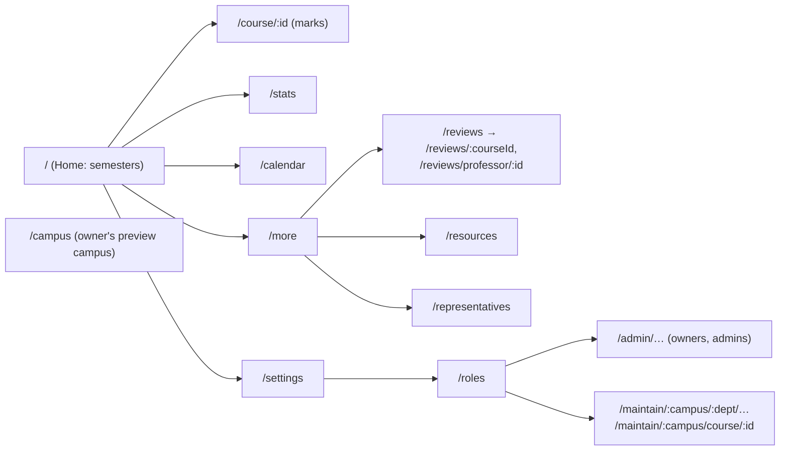

Route guards redirect anyone without the right grant back to `/`.

## 11. Environments, testing and deployment

The build chooses its backend with a compile-time define,
`POINTER_ENV=prod|staging|emulator` (`lib/core/env`). Production is the
default. Test sign-in (`?as=<account>`) exists only in staging and emulator
builds: `isTestEnv` is a `const`, so the compiler removes that code from a
production build entirely, and `test/env/prod_build_guard_test.dart` keeps it
that way.

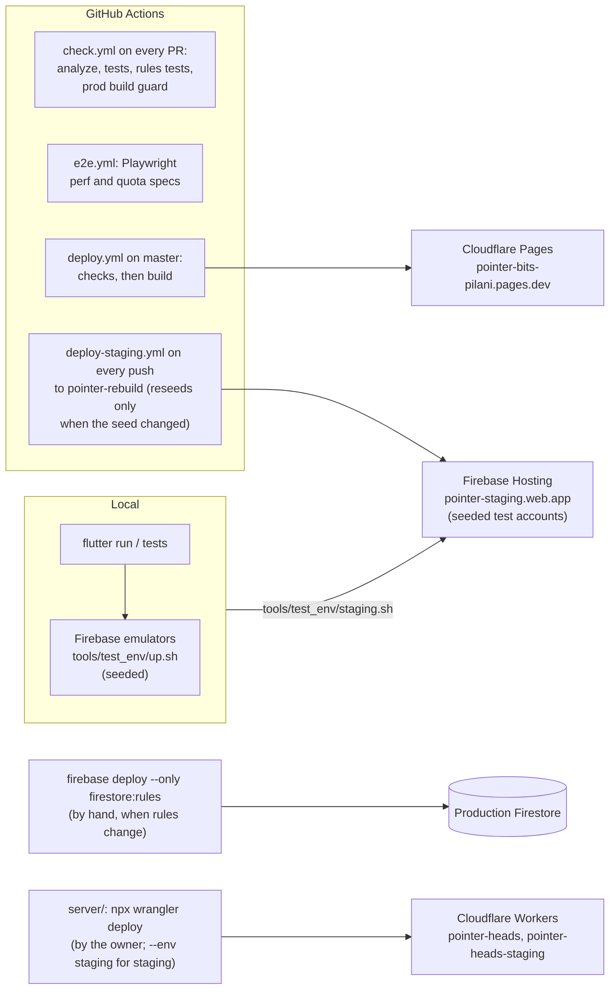

| Command | What it checks |
|---|---|
| `flutter test` | Unit, widget and render tests |
| `cd test/rules && npm test` | `firestore.rules` against the emulator |
| `python3 agent_toolchains/code/verify.py` | Format, analyzer baseline and the full test suite |
| `python3 agent_toolchains/ui_check/ui_check.py run` | Renders every screen in light and dark at phone widths and reports layout, contrast and tap-size problems |
| `tools/e2e` (Playwright) | End-to-end, performance and quota budgets on the seeded emulator |

## 12. Things that will surprise you

- **Legacy files are deliberately unformatted.** `main.dart`, `home_page.dart`,
  `script.dart`, `course.dart`, `mastercourselist.dart`, `sync.dart` and
  `settings_page.dart` predate the rebuild; running `dart format` on them
  rewrites them wholesale. Edit them by hand.
- **Email-keyed maps and Firestore.** On the web, `SetOptions(mergeFields:)`
  splits a field path at every dot, so an email as a map key breaks. Use
  `update` with a `FieldPath`. `fake_cloud_firestore` gets these writes wrong
  too, so test them on the emulator.
- **Hive writes in widget tests** stall under fake time; test storage in unit
  tests and give widget tests in-memory data.
- **A new Hive box** has to be opened at startup, added to sync if it's
  personal, and cleared on sign-out.
- **The web API key is public by design.** Firebase web config is meant to be
  shipped; the rules and API-key restrictions are what protect data.
- **The app never draws above 2× pixel density.** `web/index.html` caps
  `window.devicePixelRatio` at 2 before the engine starts; `?dpr=3` lifts the
  cap for comparison (§13).
- **The WebAssembly build is stricter about JS numbers.** `dartify()` returns
  a `double` there, so `as int` on a browser value throws (and a throw after
  the first frame blanks the app). Read JS numbers as `num`.

## 13. Performance and loading

### Measured

Staging, Chrome throttled to 4× CPU, a phone-sized window, medians of 5–10
loads, unless the row says otherwise. Each row's before and after used the
same setup; the first two rows toggled only that change on one build.

| What | Before | After | Change |
|---|---|---|---|
| Repeat visit, first frame, iPhone user agent | 2.05 s | 1.68 s | Firebase sign-in check starts with the page (`c7fef0e`) |
| Repeat visit, first frame, desktop | 1.80 s | 1.50 s | same |
| Repeat visit, bytes downloaded | 858 KB | 176 KB | app files revalidate to a 304 (`d6c390c`) |
| Repeat visit, first frame | 7.1 s | 3.2 s | same |
| Cold load, first frame (4× CPU, 1.6 Mbps) | 21.7 s | 20.0 s | analytics after the first frame, Firebase SDK preloaded (`445008c`) |
| iPhone loads stalling ~30 s on the first sync | 3 in 10 | 0 in 10 | Firestore long polling on iOS (`9d8ed37`) |
| Missed frames, Settings / Reviews / theme switch (real GPU) | 50 / 32 / 29 % | 23 / 19 / 19 % | CanvasKit draws straight to the screen (`5a58613`) |
| iPhone 13 scrolling | judder (18–34 screen updates/s) | smooth (owner, by feel) | at most 2× pixel density, 44 % fewer pixels a frame (`a9d7978`) |
| Reopening Resources, Reviews, Representatives, admin pages | spinner every time | last data at once | per-screen session cache (`a9d7978`, `c78433c`) |
| Opening Resources, Reviews, Representatives after a relaunch | spinner, then a network read | saved data in the first frame, no spinner (9 of 9 loads) | data kept on the phone, drawn by `peek` (`d468333`–`e4a0897`) |

Staging, unlike production, turned Flutter's semantics tree on for every
load (the E2E finders need it), so every scroll frame also updated the
hidden accessibility DOM; now only the emulator (E2E) build has it by
default, and `?semantics=1` turns it on elsewhere (2026-10-04). Touch resampling is off by default since the same day: with
frames on time it only delayed the finger and leapt on lift (`?resample=1`
turns it on). The WebAssembly renderer, single- and multi-threaded, was no
better than the JS build on iPhone.

### Where a repeat visit's time goes now

About 1.5 s at 4× CPU: ~0.35 s loading the engine and app files from cache,
~0.3 s evaluating `main.dart.js`, ~0.65 s building Home's first frame and
~0.45 s drawing it. The sign-in check overlaps the first two. `window.pointerPerf.timings()`
prints every startup step in staging and test builds.

### Loading design

Goal: no screen waits on the network, including the first open after a
relaunch. It is the client half of the server plan in
[`agent_instructions/DATA_SYNC_PLAN.md`](../agent_instructions/DATA_SYNC_PLAN.md).

**Every data store keeps its data on the phone.** Each store read
(resources, reviews, representatives, professors, roles, offerings, admin
data) goes through `cacheFirst` (`lib/core/cache`), which saves the last value
in the `sharedCache` box. A screen draws the saved copy in its first frame
(`peek`) and asks for fresh data behind it; a failed refresh keeps the saved
copy. Screens that read live queues (publish drafts, the contact editor, CR
handover, department moderation) also draw their last list at once, but keep
every button that writes disabled until the fresh list arrives. A spinner
shows only the first time a device opens a screen. Live search is not cached.

**Freshness comes from version markers, not timers.** Every shared path has a
version number in `heads/{campus}` (DATA_SYNC_PLAN Stage 1), and every write
bumps it in the same batch. While the live socket is connected, a saved copy
is current while its path's version hasn't moved, so a check costs no reads
beyond the head itself; when a version moved, the screen keeps drawing the
saved copy and swaps in the fresh one as soon as it arrives. Without the
socket (not deployed, offline, or after 3 failed connects) a saved copy also
needs to be younger than its store's age limit (10 minutes for reviews and
admin data), as before. A Cloudflare Worker serves the head (Stage 2) and a
WebSocket per client pushes it (Stage 3).

**Screens load ahead, level by level, after the first frame:**

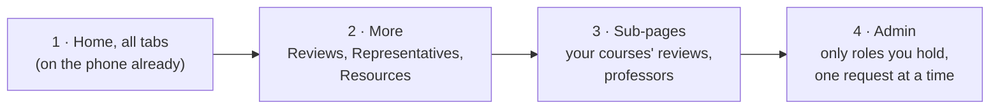

Level 2 starts 2 s after the first frame so startup stays smooth; each level
starts when the previous one finishes; anything whose version hasn't moved is
skipped; prefetch pauses offline and runs once per session; a screen opened
early jumps the queue.

**Built (`pointer-rebuild`):** the on-phone caches and `peek` on every
screen, level prefetch, Stage 1 markers with rules, and the Stage 2 Worker
and Stage 3 Durable Object in `server/`. Staging runs its own Worker
(`pointer-heads-staging`, `wrangler deploy --env staging`), verified with two
browsers; production waits for the owner's deploy. Without
`POINTER_HEADS_URL` and `POINTER_LIVE_URL` the app reads `heads/{campus}`
from Firestore as before.

**Cost limits (free plans):** each campus hub reads Firestore at most once
every 20 s (≤ ~17k reads a day for all four, under the 50k Spark limit);
`GET /heads` keeps a 60 s copy per Worker instance, so it costs about one
read a minute whatever the traffic, and browsers don't cache it. A publisher
skips the Worker for 3 minutes after their own catalogue or contact change,
so they see it at once.

**Push (Stage 3):** a writer commits its Firestore batch first, then pokes
the path. The campus's Durable Object waits ~1.5 s to gather pokes, reads the
committed head from Firestore (at most one read every 20 s) and sends the `v`
map to every socket only if it moved. Client-sent data is never broadcast.

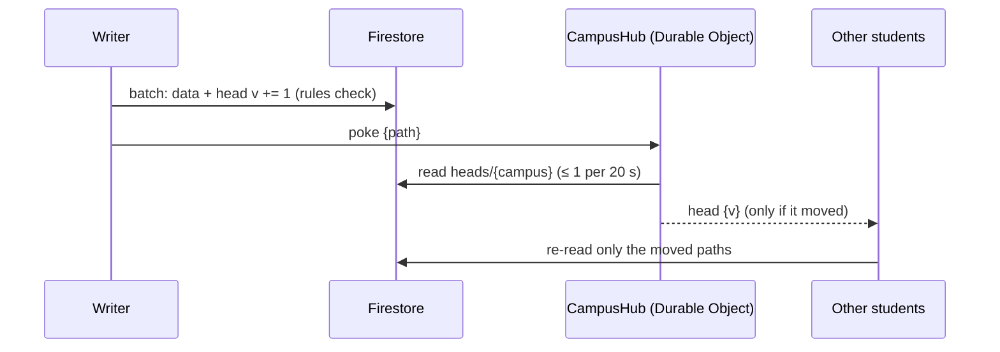

Personal data works the same way without touching Cloudflare's copy of any
grades: after a sync push the app sends `pokeMe` (~2 s after the last
write), the Durable Object moves that account's counter and tells only that
account's other sockets, which pull the user document from Firestore.

