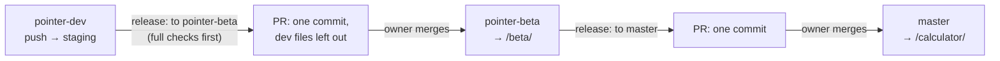

# Developing Pointer

This guide lives on `pointer-dev` only, like everything it describes: the
tests, the local emulators, the tools and the design records. `master` and
`pointer-beta` carry the app alone (see
[README → Release channels](../README.md#release-channels-and-branches)).
How the system works is in [ARCHITECTURE.md](ARCHITECTURE.md).

- [Setting up](#setting-up)
- [Running the app](#running-the-app)
- [Tests and checks](#tests-and-checks)
- [Releasing](#releasing)
- [Deploying by hand](#deploying-by-hand)
- [Data tools](#data-tools)
- [What lives where on this branch](#what-lives-where-on-this-branch)
- [House rules](#house-rules)

## Setting up

**You need:** [Flutter](https://docs.flutter.dev/get-started/install) (Dart
SDK ^3.7; CI pins 3.47.5 for staging), [Node.js](https://nodejs.org/) 22, the
[Firebase CLI](https://firebase.google.com/docs/cli) and Java 21 (for the
Firestore emulator). Python 3 runs the verification scripts.

```sh
git clone -b pointer-dev https://github.com/e-iotapi/Pointer.git
cd Pointer
flutter pub get
```

## Running the app

### Against local emulators (recommended)

Starts the Auth and Firestore emulators, seeds them with test accounts and
data, and serves the app against them. Nothing touches a real project.

```sh
tools/test_env/up.sh
```

Open the app with `?as=<account>` to sign in as a seeded user, for example
`?as=student_full`, `?as=president` or `?as=owner`. The accounts are in
[`test_env/accounts.json`](../test_env/accounts.json).

### Build environments

The backend is picked at compile time with `--dart-define=POINTER_ENV=…`:

| `POINTER_ENV` | Backend | Test sign-in (`?as=`) |
|---|---|---|
| `prod` (default) | Production Firebase | removed from the build |
| `staging` | The `pointer-staging` Firebase project | yes |
| `emulator` | Local emulators | yes |

`flutter run -d chrome --web-port 5000` with no define talks to production
with real Google sign-in, so it needs a BITS account.

### The UI-only demo

[`demo/`](../demo) runs the real app over the test fakes, with no backend:
every sign-in is a made-up owner and the data is
`test/helpers/fake_seed.dart`, reseeded on each load. `demo/build.sh` builds
it into `build/demo`.

## Tests and checks

```sh
flutter test                               # unit, widget and render tests
cd test/rules && npm install && npm test   # security rules, on the emulator
python3 agent_toolchains/code/verify.py    # analyzer baseline + full suite
```

- **Screen checks:** `python3 agent_toolchains/ui_check/ui_check.py run`
  renders every screen in light and dark at phone widths and reports overflow,
  contrast and tap-size problems.
- **End to end:** [`tools/e2e`](../tools/e2e) runs Playwright specs, including
  performance and Firestore-quota budgets, against the seeded emulator
  (`e2e.yml`, run by hand).
- **Analyzer baseline:** CI fails on any analyzer issue not in
  `tools/analyze_baseline.txt`; the legacy files' old issues are listed there.

`check.yml` runs the analyzer baseline, every test, the rules tests and a
production-build guard (test sign-in must not reach a prod build) on every
pull request into `pointer-dev`, and again before every release to beta.

## Releasing



1. Push to `pointer-dev`. `deploy-staging.yml` publishes it to
   https://pointer-staging.web.app with seeded test accounts.
2. **Actions → release → Run workflow → `pointer-beta`.** The full checks run
   on `pointer-dev`; then one commit holding `pointer-dev`'s files minus the
   dev-only paths (the `DEV_ONLY` list in `release.yml`) is opened as a pull
   request into `pointer-beta`, listing every change since the last release.
3. Merge it (squash). `deploy.yml` rebuilds the site with the beta at `/beta/`.
4. When the beta is ready: **release → `master`**, merge, and the same
   workflow publishes it at `/calculator/`.

A file that should stay off `master` goes in `DEV_ONLY`. The first release
to a branch that doesn't exist yet creates it directly; run **deploy** by
hand once after that, since a push made by the workflow's token starts no
other workflow.

The beta and the stable app share one origin, one sign-in and the production
data, so **a beta must not change data in a way the stable app can't read**:
new fields are additive, and rules changes are deployed only once both
channels can live with them.

## Deploying by hand

These stay manual and are the owner's to run:

| What | Command |
|---|---|
| Firestore rules | `firebase deploy --only firestore:rules --project default` |
| Firestore indexes | `firebase deploy --only firestore:indexes --project default` (answer **No** to deleting indexes) |
| The Worker | `cd server && npx wrangler deploy` (`--env staging` for staging) |
| Staging by hand | `tools/test_env/staging.sh` (needs `STAGING_PASSWORD` and a service-account key, both outside the repo) |

The full first-time production checklist is
[`agent_instructions/PROD_DEPLOY.md`](../agent_instructions/PROD_DEPLOY.md).

`lib/firebase_options.dart` is generated by `flutterfire configure`. The
Firebase web API key in it is public by design; restrict it by HTTP referrer
in the Google Cloud console.

## Data tools

All run with Node from the repo root, take `--project`, refuse production
without `--allow-prod`, and write nothing without `--commit`. Service-account
keys are passed by path and never committed.

| Tool | What it does |
|---|---|
| `tools/timetable/extract.mjs` | Reads the timetable PDF into the published timetable, the academic calendar and course offerings |
| `tools/import/import.mjs` | `faculty`, `reviews` (the old course reviews, handouts and class averages) and `rebuild` (every summary from the source documents) |
| `tools/export_catalog.dart` | Exports the course catalogue to `assets/catalog.json` |
| `tools/subset_fonts.sh` | Subsets the bundled fonts to the characters the app uses |

Their outputs (`tools/course_reviews_out/`, `tools/perf_out/`) are
git-ignored: they hold real student data.

## What lives where on this branch

| Folder | What |
|---|---|
| `test/` | Dart tests; `test/rules` has the security-rule tests (Node, on the emulator) |
| `test_env/` | The seeded test accounts |
| `tools/` | Emulator setup and seeding, e2e specs, data import, build helpers |
| `demo/` | The UI-only demo |
| `agent_instructions/` | The design records: the detailed architecture, plans, quota sums and the UI map. Superseded ones are in `deprecated/` |
| `agent_toolchains/` | Verification, commit and screen-check scripts |

## House rules

- **Don't format legacy files.** `main.dart`, `home_page.dart`, `script.dart`,
  `course.dart`, `mastercourselist.dart`, `sync.dart` and `settings_page.dart`
  predate the rebuild and are edited by hand; `dart format` would rewrite them
  wholesale (several newer files are unformatted too: check with
  `dart format --output=none` before formatting one).
- **Never commit** `bugs/`, `bug_*.md`, `tools/perf_out/`,
  `tools/course_reviews_out/` or a service-account key.
- **Public APIs get `///` doc comments**
  ([Effective Dart](https://dart.dev/effective-dart/documentation)).
- More traps are in
  [ARCHITECTURE.md §12](ARCHITECTURE.md#12-things-that-will-surprise-you).
